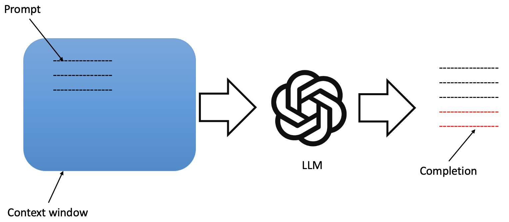

---
layout:
  title:
    visible: true
  description:
    visible: false
  tableOfContents:
    visible: true
  outline:
    visible: true
  pagination:
    visible: true
---

# ⚡ Power of Gen AI applications

## Generative AI & LLMs

Generative AI is a subset of traditional machine learning. And the machine learning models that underpin generative AI have learned these abilities by finding statistical patterns in massive datasets of content that was originally generated by humans. Generative AI applications can be a chat bot, generating images from text, or using a plugin to help you develop code. In which you see these tools is a machine that is capable of creating content that mimics or approximates human ability.

Generative AI has a wide range of potential applications, including:

* **Chatbots:** Generative AI can be used to create chatbots that can interact with users in a natural and engaging way.
* **Image generation:** Generative AI can be used to generate realistic images from text descriptions or from other images.
* **Music generation:** Generative AI can be used to generate new music, including melodies, harmonies, and rhythms.
* **Code generation:** Generative AI can be used to generate code for software applications.

## Foundation Models

The foundation models (or) base models have been trained on trillions of words over many weeks and months. These foundation models with billions of parameters, exhibit emergent properties beyond language alone. Some of the popular foundation models are

* GPT
* BERT
* FLAN-T5
* LLaMa
* PaLM
* BLOOM

Some of the models are open-sources and some are not. All the models differ in their size (number of parameters), And the more parameters a model has, the more memory, and as it turns out, the more sophisticated the tasks it can perform. We can use the foundation models as it is in our applications and we can fine-tune them to our specific use case requirements. All the models are being created for multiple modalities, including images, video, audio, and speech etc.

## Interacting with LLMs

In general, any computer application (or) API has predefined syntax in which we have to interact with them. In contrast, large language models are able to take natural language or human written instructions and perform tasks much as a human would. The input is called Prompt and the output is called completion.

<figure><figcaption></figcaption></figure>

Here are some examples of generative AI prompts and completions:

* **Prompt:** Write a poem about a cat.
*   **Completion:**

    &#x20;           &#x20;

    &#x20;       Oh, furry feline, with eyes so bright, You fill my days with such delight. Your playful antics, your cuddly purrs, I'm so glad to have you, my furry friend.


* **Prompt:** Generate an image of a cat.
*   **Completion:**

    &#x20;           &#x20;

    &#x20;     
* **Prompt:** Write a code snippet to calculate the factorial of a number.
* **Completion:**

```
def factorial(n):
  if n == 0:
    return 1
  else:
    return n * factorial(n - 1)

print(factorial(5))
```

Generative AI is a powerful new technology with the potential to revolutionize many industries. By understanding the basics of generative AI, you can start to develop your own innovative AI applications.
