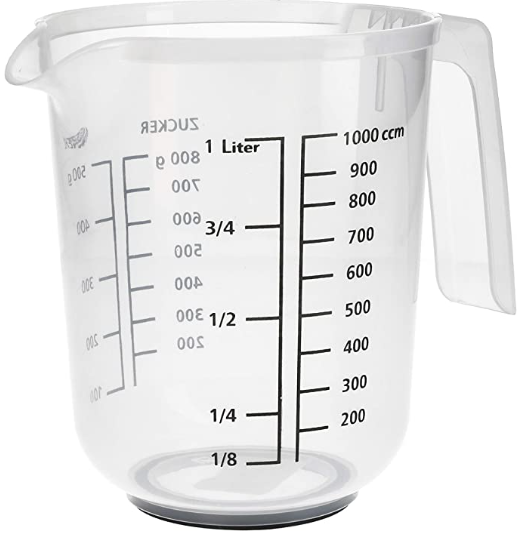

# C

<mark style="color:red;">**Calibration**</mark>

**Marking a measuring instrument with the necessary gradations ( measurements ); the resulting markings or settings**:Our measuring cups are designed with calibrations on the side so that exact measurement can be given

<figure><figcaption>
Calibrations on a cup
</figcaption></figure>
